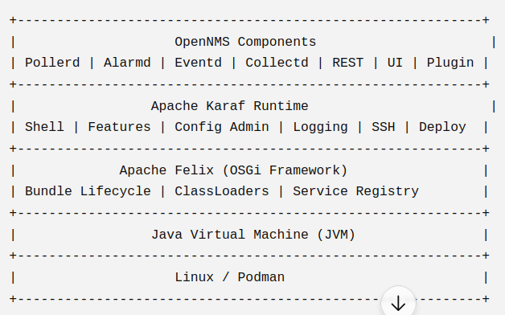

# Apache Felix: The Engine of OSGi

**Apache Felix** is an open-source project by the Apache Software Foundation that provides a direct implementation of the OSGi Core 
  Framework specification. 

If the **OSGi specification** is the rulebook for how Java modularity *should* work, **Apache Felix** is the software engine that actually runs the OSGi bundles and enforces those rules.

---

## 🐟 The Analogies: How It All Fits Together

To understand the architecture stack, we can look at it through two lenses: 

**The Aquarium Analogy**
*   **OSGi:** The laws of physics and nature (the rules).
*   **Apache Felix:** The actual water and gravity that enforce those rules.
*   **Apache Karaf:** The glass tank, the water filter, and the lighting system built around the water.
*   **Your Plugins:** The fish swimming inside.

**The Operating System Analogy**
*   **Apache Felix** is the Kernel. It sits completely out of sight but does all the heavy lifting to execute Karaf's commands. Like a 
      kernel, Felix is responsible for resource management inside the OSGi world: bundle lifecycle, module isolation, and service discovery.
*   **Apache Karaf** is the enterprise runtime built on top of Apache Felix. It provides the management layer (shell, configuration, 
      features, deployment) and translates user commands, while Felix provides the underlying OSGi runtime that actually executes the bundles.

---

## ⚙️ Apache Felix: Core Responsibilities

Inside your OpenNMS/Karaf environment, Apache Felix sits right on top of the Java Virtual Machine (JVM). It has a very small footprint and is strictly responsible for three critical jobs:

1.  **Lifecycle Management:** 
    When you type `bundle:install` or `bundle:start` in the Karaf console, Karaf hands that request down to Felix. Felix is the engine that physically loads your `.jar` file into memory, checks its dependencies, and starts, stops, or uninstalls it—all without rebooting the JVM.
    *   *Under the hood:* Felix reads the bundle metadata (`MANIFEST.MF`), resolves imported and exported packages, initializes the isolated ClassLoader, registers any published services, and transitions the bundle through its lifecycle states (Installed → Resolved → Active).
2.  **Classloading Isolation (The "Invisible Shields"):** 
    Felix acts as the bouncer that reads the `MANIFEST.MF` in your `.jar` file. It physically builds the isolated ClassLoader walls around your plugin so that your libraries never clash with OpenNMS's core libraries.
3.  **Service Registry:** 
    Felix acts as the internal "phonebook" where bundles register and discover services. When your `BackupRestore` plugin asks for an `SshService`, Felix looks up who provides it and securely wires them together.

---

## 🚀 Why We Interact with Karaf, Not Felix

Apache Felix is incredibly low-level and bare-bones. It has almost no user interface, no advanced logging, and no SSH server. 

If you just ran raw Apache Felix, deploying a plugin would be a nightmare of typing massive filesystem paths and manually resolving dozens of dependencies one by one.

**Apache Karaf** (the container we use in OpenNMS) was created to wrap Apache Felix in a user-friendly enterprise container. 
*   **Karaf** gives you the nice `karaf@root>` SSH console, logging, the `features.xml` dependency resolver, and the hot-deploy folders.
*   Underneath, Karaf translates our commands and hands them directly to **Felix** to quietly execute the class isolation and service wiring.

---

## 💡 Why OpenNMS Uses This Stack

OpenNMS builds upon this Felix/Karaf architecture because enterprise monitoring requires three things:

1.  **Zero-Downtime Hot Swapping:** You can upgrade or deploy new plugins while the core system continues to monitor the network without missing a beat.
2.  **Dependency Isolation:** Third-party plugins cannot crash the main system by introducing conflicting Java libraries. 
3.  **Distributed Monitoring:** Because the Felix footprint is so small, OpenNMS can package it into lightweight "Minions" and "Sentinels" deployed deep inside remote, secure networks.

---

## 📌 Key Takeaways

*   **✔ OSGi** defines the rules for modular Java applications.
*   **✔ Apache Felix** implements those rules by managing bundle lifecycle, package resolution, classloader isolation, and the OSGi  
        service registry.
*   **✔ Apache Karaf** builds on Felix by adding enterprise tooling such as the shell, features service, configuration management, 
        logging, and deployment support.
*   **✔ OpenNMS** is an application composed of many OSGi bundles that run inside Karaf, which itself runs on Felix.