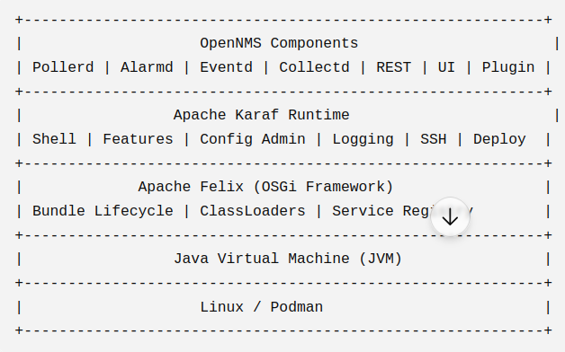

Apache Felix is the OSGi framework implementation that actually runs your OSGi bundles.
Apache Karaf (the container we use in OpenNMS) is built around Apache Felix. Felix provides the core wiring, and Karaf wraps it in a nice shell with logging, SSH, and feature management.

If Karaf is the operating system, then Felix is the kernel.

Apache Karaf: Commands, Features, Config, Shell
Pollerd -> Karaf -> Felix -> JVM

Analogy: Connect it back to the "aquarium" and "car engine" analogies used previously to maintain consistency. 
(OSGi = the laws of physics/rulebook; Felix = the actual water/engine; Karaf = the aquarium glass/car chassis).

Karaf uses Felix under the hood to handle the actual classloading, bundle lifecycle (Install, Start, Stop), and Service Registry.

Features: Mention its footprint (very small) and its core responsibilities.

We interact with Karaf. Karaf is just a wrapper around Felix that provides the nice SSH console, logging, and feature:install commands. Underneath, Karaf translates our commands and hands them to Felix to execute.

OSGi is the laws of physics (the rules).
Apache Felix is the water and gravity that actually enforce the rules.
Apache Karaf is the glass tank, the filter, and the lighting system built around the water.
Your plugins are the fish.

Apache Felix is incredibly low-level and bare-bones. It has almost no user interface, no advanced logging, and no SSH server.
If you just ran raw Apache Felix, deploying a plugin would be a nightmare of typing massive filesystem paths and manually resolving dozens of dependencies one by one.

Apache Karaf was created to wrap Apache Felix in a user-friendly enterprise container. Karaf gives you the nice karaf@root> SSH console, the features.xml dependency resolver, and the hot-deploy folders, while letting Apache Felix quietly do the heavy lifting of class isolation in the background.

