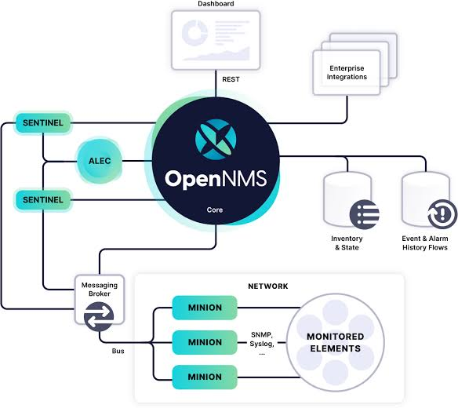

Like the  `GreetingConsumer` and `GreetingProvider`, the exact mental model required to understand how OpenNMS polls millions of data points across a network.

# Whiteboard Pattern
* OpenNMS uses a design pattern in OSGi called the **Whiteboard Pattern**. It relies on the same Publish-Find-Bind mechanics we just tested, but dialed up to a massive scale.

Here is exactly how OpenNMS translates OSGi into a high-performance SNMP polling engine.

## 1. The Poller Daemon (The Ultimate Consumer)

Inside OpenNMS, there is a core OSGi bundle called the **PollerDaemon**. You can think of it exactly like your `GreetingConsumer`, but with one major difference.

Instead of asking the Service Component Runtime (SCR) for a single specific service (`1..1`), the PollerDaemon uses a **multiple cardinality reference**. It tells Felix: *"Give me every single bundle in the JVM that implements the `ServiceMonitor` interface."*

```java
// How the OpenNMS PollerDaemon requests dependencies
@Reference(cardinality = ReferenceCardinality.MULTIPLE)
private List<ServiceMonitor> monitors;

```

The PollerDaemon itself doesn't know what SNMP, HTTP, or ICMP (Ping) are. Its only job is to look at the database, build a schedule (e.g., "Check Router A every 5 minutes"), pull a worker thread from a high-speed pool, and hand the task off.

## 2. The SNMP Plugin (The Provider)

If the PollerDaemon doesn't know how to poll, who does? The **Providers**.

OpenNMS ships with an OSGi bundle called `opennms-services-snmp`. Inside that bundle is a class called `SnmpMonitor` that implements the `ServiceMonitor` interface.

When OpenNMS boots up:

1. The SNMP bundle wakes up (just like your `GreetingServiceImpl`).
2. It publishes itself to the OSGi Service Registry as a `ServiceMonitor` with a property: `type = SNMP`.
3. The SCR engine instantly injects the memory pointer of the `SnmpMonitor` into the running PollerDaemon's `List<ServiceMonitor>`.

When the PollerDaemon sees that a router needs an SNMP check, it simply loops through its list of monitors, finds the one labeled "SNMP", and calls `monitor.poll(ipAddress)`. Because they share the same JVM memory, this handoff takes roughly 5 nanoseconds.

## 3. Scaling to Thousands (The Minion Architecture)

Polling via memory pointers is incredibly fast, but if a single JVM tries to open 50,000 parallel network sockets to poll 50,000 routers, the Linux operating system will run out of file descriptors and the server's network card will choke.

To solve this, OpenNMS physically breaks the OSGi ecosystem apart across a network using **Minions** and a **Message Broker (Kafka/ActiveMQ)**.



---

Here is how OSGi makes distributed polling seamless:

1. **The Core delegates:** The central OpenNMS PollerDaemon realizes Router A is in a datacenter in London. Instead of polling it directly, the core serializes the polling instruction ("Do an SNMP check on 10.0.0.1") and drops it onto a Kafka message queue.
2. **The Minion receives:** A Minion is just a tiny, headless Karaf container running in that London datacenter. It pulls the message off the Kafka queue.
3. **Local OSGi execution:** Inside the Minion JVM, the exact same `opennms-services-snmp` bundle is running! The Minion's internal OSGi registry wires the `SnmpMonitor`, executes the poll locally at CPU speed, and gets the result.
4. **The Return:** The Minion puts the result ("Latency: 12ms, Status: UP") back on the Kafka queue. The core server reads it and updates the database.

## Why this is brilliant software engineering

Because OpenNMS relies on OSGi interfaces, the system is infinitely extensible without touching the core code.

If your company invents a proprietary piece of hardware that uses a custom TCP protocol, you don't need to ask the OpenNMS developers to add it. You just write a new Java bundle, implement `ServiceMonitor`, and drop your `.jar` into the `deploy/` folder. The PollerDaemon will instantly discover it in the registry and start using it—with zero downtime.


# You have just asked one of the most advanced and insightful questions about OSGi.

You correctly realized that in standard Java (and frameworks like Spring), if you inject dependencies via a constructor, the only way to add a new dependency to a List is to destroy the object and build a new one.

If OSGi did that, OpenNMS would drop thousands of packets every time a new plugin was installed because the `PollerDaemon` would have to shut down and restart!

To prevent this, OSGi Declarative Services (DS) uses a feature called **Dynamic Reference Policies**. Here is exactly how SCR updates the live object in memory without ever restarting it.

                     Apache Karaf
                          │
                          │
                  OSGi Service Registry
                          │
        ┌─────────────────┼──────────────────┐
        │                 │                  │
        │                 │                  │
 SNMP Monitor      HTTP Monitor      ICMP Monitor
(ServiceMonitor) (ServiceMonitor)  (ServiceMonitor)
        │                 │                  │
        └─────────────────┼──────────────────┘
                          │
                SCR (Declarative Services)
            Automatically injects services
                          │
                          ▼
                 PollerDaemon Component
                          │
             CopyOnWriteArrayList<ServiceMonitor>
                          │
                          ▼
                 Polling Scheduler Thread

### Notice that PollerDaemon never creates the monitors.
  * It simply says: "Give me every ServiceMonitor that exists."

### The Secret: ReferencePolicy.DYNAMIC

When an OpenNMS developer writes the `PollerDaemon` code, they don't just ask for a List. They explicitly tell SCR: *"I want this list to be updated on the fly. Do not reboot me when things change."*

They do this by setting `policy = ReferencePolicy.DYNAMIC` inside the `@Reference` annotation.

When you make a reference dynamic, SCR gives the developer two ways to handle the live injection: **Bind Methods** or **Volatile Fields**.

---

### Method 1: The "Bind/Unbind" Event (The Classic Way)

Instead of injecting the list directly into a variable, the developer gives SCR two helper methods: a `bind` method (to call when a service arrives) and an `unbind` method (to call when it leaves).

```java
@Component(immediate = true)
public class PollerDaemon {
    
    // A thread-safe list to hold the monitors
    private final List<ServiceMonitor> monitors = new CopyOnWriteArrayList<>();

    // SCR calls this method on the LIVE object when the SNMP bundle is installed
    @Reference(
        cardinality = ReferenceCardinality.MULTIPLE, 
        policy = ReferencePolicy.DYNAMIC,
        bind = "addMonitor", 
        unbind = "removeMonitor"
    )
    public void addMonitor(ServiceMonitor newMonitor) {
        System.out.println("A new monitor arrived! Adding to schedule...");
        this.monitors.add(newMonitor);
    }

    // SCR calls this method on the LIVE object if the SNMP bundle is uninstalled
    public void removeMonitor(ServiceMonitor oldMonitor) {
        System.out.println("A monitor was removed. Pausing its schedule...");
        this.monitors.remove(oldMonitor);
    }
}
```

What Does @Reference Mean?
@Reference(
    cardinality = MULTIPLE,
    policy = DYNAMIC
)

It tells SCR: I need ALL ServiceMonitor services.

Whenever one appears

↓

call addMonitor()

Whenever one disappears

↓

call removeMonitor()

Think of it like a subscription.

             OSGi Registry

      New Service Registered
               │
               ▼
      Notify all subscribers
               │
               ▼
     PollerDaemon.addMonitor()


# The Real Architecture

                JVM
                 │
                 ▼
          Apache Karaf
                 │
                 ▼
      Apache Felix OSGi Framework
                 │
                 ▼
    Service Component Runtime (SCR)
                 │
      ┌──────────┴───────────┐
      │                      │
Creates Components     Watches Registry
      │                      │
      ▼                      ▼
 PollerDaemon          Service Registry

## SCR builds an internal record that is conceptually like:

PollerDaemon

Needs:

ServiceMonitor

Bind method:

addMonitor()

Unbind method:

removeMonitor()

## Inside SCR (Conceptually)

Imagine SCR maintains a table like this:

Managed Components

+----------------+-------------------+
| Component      | Wants             |
+----------------+-------------------+
| PollerDaemon   | ServiceMonitor    |
| Alarmd         | EventForwarder    |
| REST API       | DatabaseService   |
+----------------+-------------------+

This is not your code.

This is SCR's internal metadata.

## Is SCR a Parent?

No.

The object relationships look like this:

              SCR

         creates objects

      ┌──────────┴──────────┐
      │                     │
      ▼                     ▼
PollerDaemon         SnmpMonitor

SCR owns their lifecycle.

But

PollerDaemon

does not inherit from SCR.

Neither does

SnmpMonitor

They are just normal Java classes.


### ------------------------------------------------------------   

**How it works:** When you drop the SNMP `.jar` into the `deploy/` folder, SCR finds the memory pointer for the new `SnmpMonitor`. Because the policy is dynamic, SCR simply invokes `addMonitor(snmpPointer)` on the already-running `PollerDaemon` instance. The polling loop never stops.

---

### Method 2: The "Volatile Field" (The Modern Way)

In newer versions of OSGi (DS 1.3+), developers don't even have to write the `bind` and `unbind` methods. SCR can dynamically swap out the list under the hood using Java Reflection—but only if the developer marks the Java field as `volatile`.

```java
@Component(immediate = true)
public class PollerDaemon {

    @Reference(
        cardinality = ReferenceCardinality.MULTIPLE,
        policy = ReferencePolicy.DYNAMIC,
        policyOption = ReferencePolicyOption.GREEDY
    )
    // The 'volatile' keyword tells the JVM: "Warning, another thread (SCR) 
    // might change this memory address at any millisecond."
    private volatile List<ServiceMonitor> monitors;

    public void pollLoop() {
        // Because it's volatile, the loop always reads the freshest list.
        for (ServiceMonitor monitor : monitors) {
            monitor.poll();
        }
    }
}

```

**How it works:** When the SNMP `.jar` is installed, SCR quietly creates a *brand new list* containing all the old monitors plus the new SNMP one. Then, using reflection, it swaps the `monitors` pointer to look at the new list. Because the field is `volatile`, the PollerDaemon's worker threads instantly see the new list on their next CPU cycle, without missing a beat.

### The Catch (The Default is Static!)

If a developer forgets to add `policy = ReferencePolicy.DYNAMIC`, OSGi defaults to `STATIC`.
If a reference is static and a new `ServiceMonitor` arrives, **SCR will actually shut down and restart the component** to wire it safely! This strictness forces developers to think very carefully about thread safety when building 24/7 systems like OpenNMS.

# How the SCR Works (The Lifecycle)
When you write an OpenNMS plugin, the SCR completely takes over the management of your Java class. It operates in a three-step cycle:

1. The Discovery Phase
When you drop your .jar (bundle) into Karaf, the SCR immediately intercepts it. It looks inside the META-INF/MANIFEST.MF file for a header called Service-Component. This tells the SCR to look for XML descriptor files (which Maven automatically generated from your @Component annotations).

The SCR reads this XML to understand your component's "blueprint": what interfaces it provides, and what @Reference dependencies it requires.

2. The Dependency Tracking Phase (SATISFIED vs UNSATISFIED)
The SCR does not instantiate your Java class right away. First, it checks the OSGi Service Registry.

If your class asks for an EventIpcManager and it is missing, the SCR puts your component into an UNSATISFIED state. It simply waits.

The millisecond the EventIpcManager appears in the registry, the SCR flips your component to SATISFIED.

3. The Activation Phase (ACTIVE)
Once all mandatory dependencies are satisfied, the SCR acts:

It creates an instance of your Java class (new CustomAlarmInterceptor()).

It calls your @Reference bind methods or uses Java Reflection to inject the required services into your variables.

It calls your @Activate method so you can run your startup logic.

Finally, it publishes your component into the OSGi Service Registry for other bundles to use.

Your component is now ACTIVE.

Why OpenNMS relies on Apache Felix SCR
In the OSGi ecosystem, there are a few different implementations of the SCR specification (like Eclipse Equinox DS), but Apache Karaf (and therefore OpenNMS) uses Apache Felix SCR.

OpenNMS relies heavily on this engine because it eliminates boilerplate code. Before Declarative Services and the SCR existed, developers had to write hundreds of lines of "Service Tracker" code just to safely look up a service in the registry, check if it was null, listen for it to disappear, and manually unregister it.

The SCR abstracts all of that danger away. You just write a plain Java object (a POJO), add an @Reference annotation, and trust the SCR to safely manage the memory pointers in real-time.


# How do I use OSGi ConfigAdmin and SCR to inject variables (like API keys or passwords) into my component without hardcoding them?

Hardcoding API keys is a dangerous trap, especially in a system like OpenNMS where configurations often differ between production, testing, and remote Minions.

OSGi solves this using the **Configuration Admin (ConfigAdmin)** service. Just like the SCR automatically injects Java objects into your component, ConfigAdmin automatically injects configuration files into your component.

Even better: if you edit the configuration file on the server, **SCR will inject the new values into your live code without restarting the bundle.**

Here is the modern, type-safe way to do this using OSGi Declarative Services (DS 1.3+).

1. **Define the Configuration Interface:**
Instead of parsing messy property maps, modern OSGi allows you to define an `@interface` that strictly defines what configuration variables your component expects.

Create this in your Java project. The `@ObjectClassDefinition` tells OSGi that this is a configurable blueprint.

```java
package com.example.opennms.plugin;

import org.osgi.service.metatype.annotations.AttributeDefinition;
import org.osgi.service.metatype.annotations.AttributeType;
import org.osgi.service.metatype.annotations.ObjectClassDefinition;

@ObjectClassDefinition(
    name = "Custom Alarm Interceptor Config", 
    description = "Configuration for the external ticketing API"
)
public @interface InterceptorConfig {

    @AttributeDefinition(name = "API URL", description = "The REST endpoint for Jira/ServiceNow")
    String api_url() default "https://api.example.com/v1/tickets";

    @AttributeDefinition(name = "API Key", type = AttributeType.PASSWORD)
    String api_key() default "UNSET";
    
    @AttributeDefinition(name = "Timeout", description = "Timeout in milliseconds")
    int timeout_ms() default 5000;
}

```

*Note: You may need to add `org.osgi.service.metatype.annotations` to your `pom.xml` dependencies.*


2. **Inject the Config into Your Component:**
Now, you link that configuration interface to your component using the `@Designate` annotation.

When SCR activates your component, it automatically reads the server's configuration, maps the values into your `InterceptorConfig` interface, and passes it directly into your `@Activate` method!

```java
package com.example.opennms.plugin;

import org.osgi.service.component.annotations.Activate;
import org.osgi.service.component.annotations.Component;
import org.osgi.service.component.annotations.Modified;
import org.osgi.service.metatype.annotations.Designate;

// 1. Tell OSGi this component uses our specific configuration interface
@Designate(ocd = InterceptorConfig.class)
// 2. Set the configuration PID (The unique ID for the config file)
@Component(
    immediate = true, 
    configurationPid = "com.example.interceptor"
)
public class CustomAlarmInterceptor {

    private String apiKey;
    private String apiUrl;

    // 3. SCR injects the configuration exactly when it activates!
    @Activate
    public void start(InterceptorConfig config) {
        this.apiKey = config.api_key();
        this.apiUrl = config.api_url();
        System.out.println("[INTERCEPTOR] Booting up targeting: " + apiUrl);
    }

    // 4. (Optional but awesome) Handle live updates without rebooting!
    @Modified
    public void update(InterceptorConfig config) {
        System.out.println("[INTERCEPTOR] Config changed on disk! Reloading credentials...");
        this.apiKey = config.api_key();
        this.apiUrl = config.api_url();
    }
}

```


3. **Create the Configuration File in Karaf:**
By default, Apache Karaf maps the `configurationPid` directly to a `.cfg` file in its `etc/` folder.

In your Karaf or OpenNMS directory, create a file named exactly after your PID:
`etc/com.example.interceptor.cfg`

Add your variables to the file using the exact method names from your `@interface`:

```properties
# etc/com.example.interceptor.cfg
api_url = https://jira.mycompany.com/rest/api/2/issue
api_key = super_secret_token_999
timeout_ms = 10000

```


4. **Test the Live Hot-Reload:**
Start Karaf and deploy your bundle. It will read `etc/com.example.interceptor.cfg` and start up.

Now, while Karaf is running, open `etc/com.example.interceptor.cfg` using `vim` or `nano` in your CentOS terminal and change the `timeout_ms` to `15000`. Save the file.

Within milliseconds, a Karaf sub-system called **FileInstall** notices the file changed on disk. It tells ConfigAdmin, which tells SCR, which instantly calls your `@Modified` method. You will see your plugin update its internal state live, completely hands-free!


---

### The Power of the PID (Persistent Identifier)

The string `"com.example.interceptor"` in `@Component(configurationPid = "...")` is critical. It acts as the bridge between the physical file system of the server and the OSGi memory space.

Because the configuration lives outside the `.jar` file, you can compile your plugin once, deploy it to a Dev server with a `dev.cfg` file, and deploy the exact same `.jar` to Production with a `prod.cfg` file.


# putting a plain-text API key in a .cfg file is a security risk. How do I encrypt passwords in Karaf configuration files?

You are absolutely right. Storing plain-text credentials in a `.cfg` file is a massive security risk, especially in production environments where configuration files might be backed up to Git repositories.

To solve this, Apache Karaf provides built-in support for **Jasypt (Java Simplified Encryption)**.

The beauty of this architecture is that **your Java code doesn't change at all.** ConfigAdmin intercepts the encrypted string, decrypts it in memory using a master password, and hands the plain-text string to your `@Activate` method. Your plugin never knows the difference.

Here is how to set up Karaf to automatically decrypt `ENC(...)` blocks in your `.cfg` files.

1. **Install the Jasypt Feature:**
First, tell Karaf to load its encryption engine. In the **Karaf shell** (`karaf@root()>`), run:

```text
feature:install jasypt-encryption

```

This installs the necessary OSGi bundles to intercept configuration file reads.


2. **Set the Master Password:**
Karaf needs a "Master Password" to encrypt and decrypt your secrets.

* **For Development:** You can put this in Karaf's `etc/system.properties` file by adding a line at the bottom:
`jasypt.encryption.password=MySuperStrongMasterKey`
* **For Production:** You should never write the master password to disk. Instead, you pass it into the Karaf JVM as an environment variable when the server boots.

*(Note: If you edit `system.properties`, you need to restart Karaf for it to take effect).*


3. **Encrypt Your API Key:**
Once the feature is installed and the master password is set, Karaf gives you a built-in shell command to generate encrypted strings.

In the Karaf shell, run:

```text
jasypt:encrypt super_secret_token_999

```

Karaf will output a scrambled string, for example:
`gB4j2fL9xPz7qW1vM5kR8nC3bH0tD6mY`


4. **Update Your Configuration File:**
Open your configuration file (`etc/com.example.interceptor.cfg`) using your terminal editor.

Replace the plain-text password with the encrypted string, wrapped inside `ENC(...)`. This specific wrapper tells the ConfigAdmin interceptor that the value needs to be decrypted before being passed to your Java component.

```properties
# etc/com.example.interceptor.cfg
api_url = https://jira.mycompany.com/rest/api/2/issue
api_key = ENC(gB4j2fL9xPz7qW1vM5kR8nC3bH0tD6mY)
timeout_ms = 10000

```


### How it works at runtime

1. FileInstall detects the change to `com.example.interceptor.cfg`.
2. It reads `api_key = ENC(...)`.
3. It passes the encrypted string to the Jasypt plugin.
4. Jasypt uses your Master Password (from memory) to decrypt it.
5. The SCR engine passes the original `super_secret_token_999` directly into your `InterceptorConfig` Java interface.

This means you can safely commit your `etc/com.example.interceptor.cfg` file to a public GitHub repository, because without the Master Password environment variable on the production server, the `ENC(...)` string is completely useless!

# How does OpenNMS secure its own core passwords, like the PostgreSQL database credentials, since those aren't just standard OSGi components?

You have identified a critical gap: if OpenNMS uses Spring XML to wire its core PostgreSQL database connection, you cannot just drop an OSGi `ConfigAdmin` properties file into Karaf and expect it to work.

To solve this and unify secret management across both the Spring core and the OSGi edge, OpenNMS built a custom subsystem called the **Secure Credentials Vault (SCV)**.

The SCV is a centralized, encrypted Java Keystore (using JCEKS or PKCS12 formats) that sits underneath the entire OpenNMS application. When the Spring core reads its legacy XML files, it intercepts specific placeholder strings, queries the SCV for the decrypted password, and seamlessly injects it into the Spring Bean.

Here is exactly how OpenNMS secures the PostgreSQL credentials in its core files:

### 1. Store the Password in the Vault

Instead of using Karaf's shell, OpenNMS provides a dedicated command-line utility called `scvcli` to manage the vault from the CentOS terminal.

To encrypt and save the database password, the administrator runs:

```bash
sudo -u opennms /opt/opennms/bin/scvcli set postgres opennms YOUR_DB_PASSWORD

```

* `postgres` is the **alias** (the lookup key).
* `opennms` is the **username**.
* `YOUR_DB_PASSWORD` gets securely encrypted and written into the binary keystore file (`/opt/opennms/etc/scv.jce`).

### 2. Update the Spring XML Configuration

Next, you open the core database configuration file (`opennms-datasources.xml`).

Instead of typing the plaintext password into the JDBC connection string, you use the SCV **Metadata Expression Language**—which looks like `${scv:alias:property}`:

```xml
<!-- /opt/opennms/etc/opennms-datasources.xml -->
<jdbc-data-source 
    name="opennms" 
    database-name="opennms" 
    class-name="org.postgresql.Driver" 
    url="jdbc:postgresql://localhost:5432/opennms" 
    user-name="${scv:postgres:username}" 
    password="${scv:postgres:password}" />

```

### 3. The Boot Sequence

When OpenNMS boots up, it starts building the Spring Application Context. Before it initializes the `jdbc-data-source` Bean, it runs a pre-processor over the XML.

The pre-processor sees `${scv:postgres:password}`, unlocks the `scv.jce` file, extracts the plaintext password into memory, and hands it directly to the PostgreSQL driver. The plain-text password is never written to disk, and the XML file can be safely tracked in Git.

---

### Jasypt vs. SCV

* **Jasypt (Karaf):** Used for pure OSGi `.cfg` files running inside the Minion or Karaf shell.
* **SCV (OpenNMS):** The OpenNMS standard for injecting secrets into both legacy Spring XML files (`opennms-datasources.xml`) and modern OSGi features. It is accessible everywhere in the platform, including the Web UI dashboards and REST APIs.
